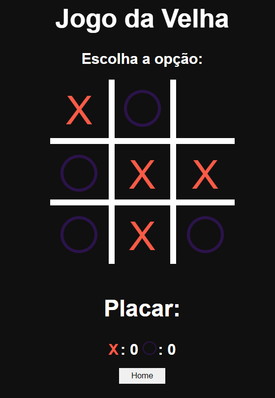

<h1 align="center"> # Jogo da Velha # </h1>

O site ideal para você se divertir com o jogo da sua infância

 <a href="#recursos">Recursos</a> •
 <a href="#tecnologias">Tecnologias</a> • 
 <a href="#status">Status</a> • 
 <a href=#imagens"> Imagens </a> • 

### Status

<h4 align="center"> 
	🎯  🚀 Projeto Concluído! 🎯
</h4>

### Recursos

- [x] Jogar multiplayer
- [x] Jogar com inteligência artificial

### 🛠 Tecnologias

As seguintes ferramentas foram usadas na construção do projeto:

- [HTML](https://pt.wikipedia.org/wiki/HTML/)
- [CSS3](https://pt.wikipedia.org/wiki/CSS3/)
- [JavaScript](https://www.javascript.com/)

### Imagens

<h1 align="center">
  
  
</h1>

